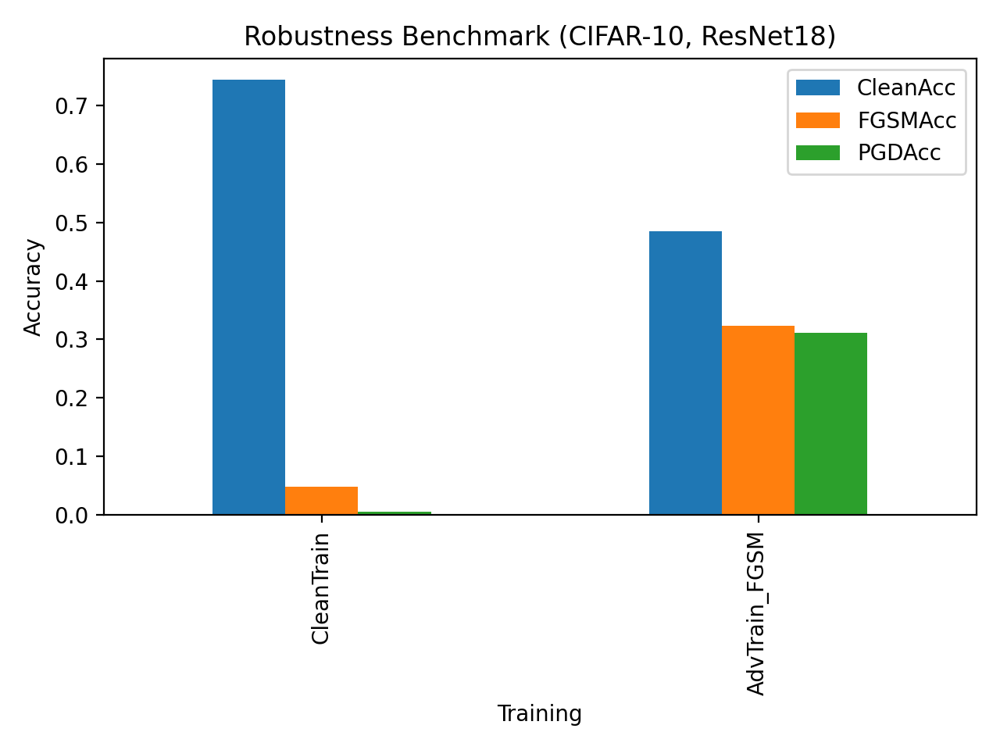

# 🛡️ AI Security: Adversarial Robustness Benchmark (FGSM, PGD, TRADES)

Research Area: **AI Security • Adversarial Machine Learning • Deep Learning Robustness**

<p align="center">


</p>

---

# 📌 Project Overview

Deep neural networks are highly vulnerable to **adversarial examples** — small, imperceptible perturbations added to input data that can drastically change model predictions.

This repository presents a **systematic adversarial robustness benchmark** evaluating how neural networks behave under adversarial attacks and how adversarial training improves robustness.

The project implements an end-to-end adversarial ML pipeline including:

• Clean model training
• FGSM adversarial attack
• PGD adversarial attack
• Adversarial training defenses
• Robustness evaluation
• Visualization of adversarial effects

The experiments are performed on the **CIFAR-10 dataset** using a **ResNet-18 convolutional neural network**.

---

# 🎯 Objectives

The main goals of this project are:

• Evaluate vulnerability of deep neural networks to adversarial attacks
• Implement and compare multiple adversarial attack methods
• Analyze the impact of adversarial training defenses
• Demonstrate the **robustness–accuracy trade-off**
• Build a reproducible adversarial ML benchmark pipeline

---

# 📄 Abstract

Adversarial attacks pose a serious security risk for machine learning systems. By applying carefully crafted perturbations to input data, attackers can manipulate model predictions while maintaining high visual similarity to the original input.

This project investigates adversarial robustness using two widely studied gradient-based attacks:

• **FGSM (Fast Gradient Sign Method)**
• **PGD (Projected Gradient Descent)**

The robustness of models trained with standard training and adversarial training is evaluated.

Experimental results show that models trained on clean data achieve high standard accuracy but are extremely vulnerable to adversarial attacks. Adversarial training significantly improves robustness against these attacks but reduces clean accuracy, illustrating the fundamental trade-off between model robustness and standard performance.

---

# 🧠 Methods

## Dataset

CIFAR-10

• 60,000 images
• 10 classes
• 32×32 RGB images

Dataset split:

• Training set: 50,000 images
• Test set: 10,000 images

---

## Model Architecture

ResNet-18 Convolutional Neural Network

Advantages:

• Deep residual architecture
• Efficient training
• Widely used benchmark model in adversarial ML research

---

## Implemented Attacks

### FGSM — Fast Gradient Sign Method

FGSM generates adversarial examples using a single gradient step:

[
x_{adv} = x + \epsilon \cdot sign(\nabla_x J(x,y))
]

Properties:

• Fast
• One-step attack
• Common baseline adversarial attack

---

### PGD — Projected Gradient Descent

PGD performs multiple iterative gradient updates to generate stronger adversarial examples.

Properties:

• Multi-step attack
• Stronger than FGSM
• Considered a **universal first-order adversary**

---

## Defense Strategies

### Adversarial Training

The model is trained using adversarial examples during training.

Implemented defenses:

• FGSM adversarial training
• PGD adversarial training
• TRADES (extension)

Adversarial training significantly improves model robustness against adversarial attacks.

---

# ⚙️ Attack Configuration

| Parameter | Value |
| --------- | ----- |
| epsilon   | 8/255 |
| alpha     | 2/255 |
| PGD steps | 10    |

---

# 📊 Experimental Results

| Model    | Training                  | Clean Accuracy | FGSM Accuracy | PGD Accuracy |
| -------- | ------------------------- | -------------- | ------------- | ------------ |
| ResNet18 | Clean Training            | **0.7439**     | **0.0484**    | **0.0050**   |
| ResNet18 | FGSM Adversarial Training | **0.4848**     | **0.3234**    | **0.3114**   |

---

## 🔍 Key Observations

### Clean-trained model

• High standard accuracy
• Extremely vulnerable to adversarial attacks

FGSM attack reduces accuracy from:

```
74.39% → 4.84%
```

PGD attack reduces accuracy to:

```
0.50%
```

---

### Adversarially trained model

• Lower clean accuracy
• Much higher adversarial robustness

FGSM robustness:

```
32.34%
```

PGD robustness:

```
31.14%
```

---

### Robustness–Accuracy Trade-off

The results demonstrate the well-known phenomenon in adversarial machine learning:

**Improving robustness often reduces standard accuracy.**

This trade-off is a central challenge in designing secure deep learning systems.

---

# 📈 Robustness Visualization

The project generates robustness comparison plots.

Example output:

```
results/figures/robustness_plot.png
```



---

# 🧪 Adversarial Example Visualization

The project can visualize adversarial examples generated by attacks.

```
Original Image → FGSM Attack → PGD Attack
```

This helps illustrate how small perturbations can significantly change model predictions.

---

# 📁 Project Structure

```
AI-Security-Adversarial-Robustness-Benchmark
│
├── configs
│   └── cifar10_resnet18.yaml
│
├── src
│   ├── attacks
│   │   ├── fgsm.py
│   │   └── pgd.py
│   │
│   ├── utils
│   │   ├── io.py
│   │   ├── metrics.py
│   │   └── seed.py
│   │
│   ├── train_clean.py
│   ├── train_adv.py
│   ├── train_pgd.py
│   ├── train_trades.py
│   ├── eval_attack.py
│   ├── eval_sweep.py
│   └── visualize_attacks.py
│
├── results
│   ├── tables
│   │   └── robustness_table.csv
│   │
│   └── figures
│       └── robustness_plot.png
│
├── requirements.txt
└── README.md
```

---

# 🚀 Installation

Clone repository

```
git clone https://github.com/Zkp1-2/AI-Security-Adversarial-Robustness-Benchmark.git
cd AI-Security-Adversarial-Robustness-Benchmark
```

Install dependencies

```
pip install -r requirements.txt
```

---

# 🏋️ Training

Train clean model

```
python -m src.train_clean --config configs/cifar10_resnet18.yaml
```

Train adversarial model (FGSM)

```
python -m src.train_adv --config configs/cifar10_resnet18.yaml
```

Train adversarial model (PGD)

```
python -m src.train_pgd --config configs/cifar10_resnet18.yaml
```

---

# 📊 Evaluation

Evaluate robustness under adversarial attacks

```
python -m src.eval_attack --config configs/cifar10_resnet18.yaml
```

Output files:

```
results/tables/robustness_table.csv
results/figures/robustness_plot.png
```

---

# 🔬 Research Context

Adversarial robustness is an active research area in **machine learning security**.

Applications include:

• Secure AI systems
• Autonomous vehicles
• Medical imaging AI
• Financial fraud detection
• Cybersecurity systems

Understanding adversarial vulnerabilities is essential for deploying reliable machine learning models in real-world environments.

---

# 🛠 Technologies

• Python
• PyTorch
• CUDA GPU acceleration
• Deep Learning
• Adversarial Machine Learning

---
# 📚 References

Goodfellow, I., Shlens, J., & Szegedy, C. (2015).  
Explaining and Harnessing Adversarial Examples.  
https://arxiv.org/abs/1412.6572

Madry, A., Makelov, A., Schmidt, L., Tsipras, D., & Vladu, A. (2018).  
Towards Deep Learning Models Resistant to Adversarial Attacks.  
https://arxiv.org/abs/1706.06083

Zhang, H., Yu, Y., Jiao, J., Xing, E., Ghaoui, L., & Jordan, M. (2019).  
Theoretically Principled Trade-off between Robustness and Accuracy (TRADES).  
https://arxiv.org/abs/1901.08573

---

# 👨‍💻 Author

**Thong Phan**

Bachelor of Computer Science — Cyber Security
Griffith University

---

# 📚 Keywords

Adversarial Machine Learning
AI Security
FGSM Attack
PGD Attack
Adversarial Training
Deep Learning Robustness
